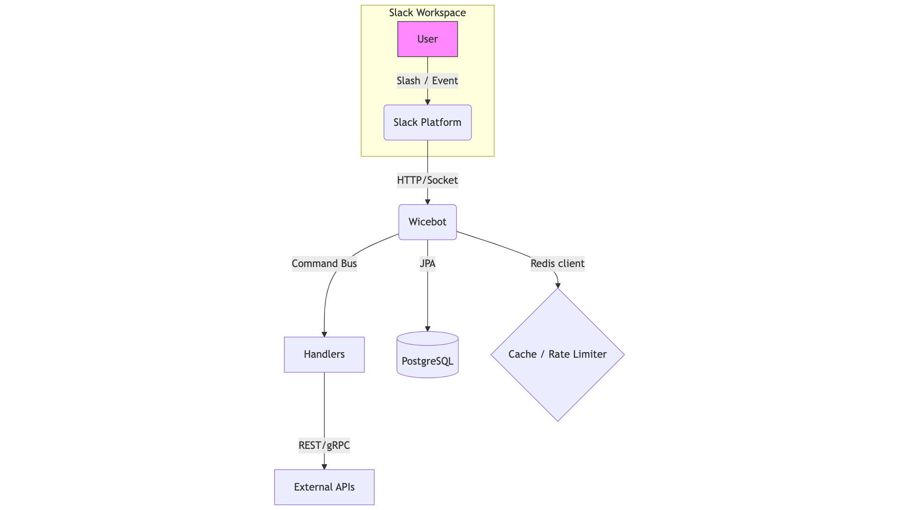
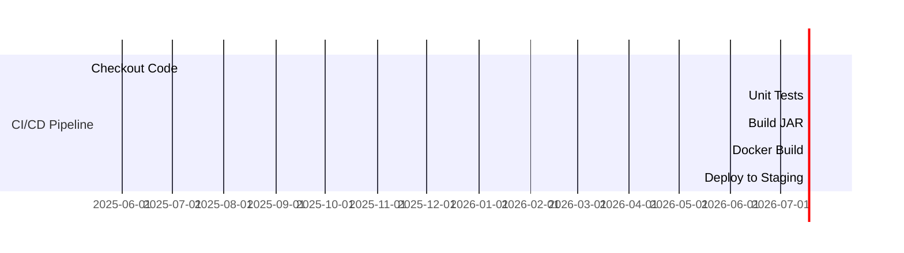

# Wicebot : Slack Assistant 💬🤖

<p align="center">
  
</p>


> **Wicebot** is a feature-rich, Java-powered Slack assistant that automates everyday workflows, answers questions with GPT-4o, and keeps your workspace humming.

[](https://youtu.be/Sdwv4zx4LJs?si=X5UJKzbqvjM2TIIE)

---

## 📒 Table of Contents
<!-- MarkdownTOC -->
1. [Features](#features)
2. [Screenshots](#screenshots)
3. [How It Works (Architecture)](#architecture)
4. [Quick Start](#quick-start)
5. [Project Structure](#project-structure)
6. [Command Reference](#command-reference)
7. [Development Workflow](#development-workflow)
8. [Roadmap](#roadmap)
9. [Contributing](#contributing)
10. [License & Acknowledgements](#license--acknowledgements)
<!-- /MarkdownTOC -->

## ✨ Features

| Category | Description |
| --- | --- |
| 🤖 AI Assistant | Natural-language Q&A, summarization, sentiment analysis (OpenAI GPT-4o) |
| 💬 Slash Commands | `/wice help`, `/wice sentiment`, `/wice jira`, `/wice weather`, `/wice standup` |
| 🗓️ Schedulers | Cron-style reminders & daily stand-up digest |
| 📌 Interactive Blocks | Modals & dialogs (e.g. create Jira ticket) |
| 🔌 Plug-in System | Add new commands via Spring `@Component` without touching core |
| 📡 Event Listeners | Reacts to message_added, reaction_added, member_joined events |
| 🔭 Observability | Prometheus metrics + structured JSON logs |
| 🛡️ Security | Slack signing secret validation & OAuth 2.0 token rotation |


## 🏗️ How It Works (Architecture)

<p align="center">
  
</p>

## 🚀 Quick Start

> **Prerequisites:** Java 17, Maven, a Slack workspace, and an OpenAI API key.

```bash
git clone https://github.com/yashjani/slackbot.git && cd slackbot
cp .env.sample .env # fill in secrets
./mvnw spring-boot:run
```

> **Docker compose** 
> `docker compose up -d` will spin up Wicebot + Postgres + Redis.


## 📂 Project Structure

```text
slackbot/
├── docs/               # Images / GIFs / extra docs
├── src/main/java/
│   ├── bot/            # Core Bolt app & config
│   ├── commands/       # Slash command handlers
│   ├── events/         # Event listeners
│   ├── schedulers/     # Quartz jobs
│   └── plugins/        # Drop-in feature modules
├── src/test/java/      # Unit & integration tests
├── .github/workflows/  # CI pipeline
└── docker-compose.yml
```

## 🗂️ Command Reference

| Command | Purpose | Example |
| --- | --- | --- |
| `/wice help` | Show help & feature list | — |
| `/wice sentiment <text>` | Detect sentiment via GPT-4o | `/wice sentiment good job` |
| `/wice jira <title>; <desc>` | Open Jira modal to file ticket | `/wice jira Login bug; Login fails on 2FA` |
| `/wice weather <city>` | Current weather via Open-Meteo | `/wice weather Vancouver` |
| `/wice standup` | Start daily stand-up thread | — |

> **Tip:** Enable shortcuts to surface commands in message composer.

## 🔧 Development Workflow

GitHub Actions →  `mvn test` → Build JAR → Containerize → Push to **ghcr.io/yashjani/slackbot**.



## 🛣️ Roadmap

- [ ] **AI Thread Summaries** – auto-summarize active channels every 6 h
- [ ] **GitHub Releases Feed** – notify on new tags
- [ ] **Voice Transcription** – convert voice messages to text (Whisper-cpp)
- [ ] **Custom Helm Chart** – push to Artifact Hub

## 🤝 Contributing

<details>
<summary>Guidelines</summary>

1. Fork → create feature branch
2. Write tests (`@SpringBootTest` + `SlackAppTest`)
3. Run `./mvnw spotless:apply`
4. Submit PR – **GitHub Actions** must pass 🟢

Feel free to open issues & feature requests. We love 🥑 first-timers!
</details>

## ⚖️ License & Acknowledgements

Licensed under the **MIT License** – see [`LICENSE`](LICENSE).

> Built with ❤ by [@yashjani](https://github.com/yashjani) & community.

Special thanks to Slack Bolt team, Spring Boot maintainers, and OpenAI.
